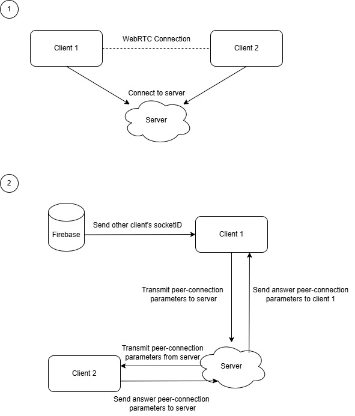

# Virtual Office

## Overview

A browser-based virtual office where each participant:

- Moves an on-screen avatar with WASD (real-time grid sync)
- Joins live video chats with every other participant
- Automatically sees new or departing users

---

## Architecture Diagram



---


## Getting Started

```bash
# 1. Clone the repo
git clone https://github.com/GopiShankarR/Open-Avenues-Project.git
cd Open-Avenues-Project

# 2. Start the signaling server
cd server
npm install
cd src
node index.js
# Server is running on port 8080

# 3. In a separate terminal, start the client
cd Open-Avenues-Project
npm install
# For every changes done in the code, the below command should be run
npm run-script build
# The build folder is ready to be deployed.
npx serve -s build
# If you see localhost successfully running, open http://localhost:3000 in your browser

# 4. Verify
# Opening multiple browser tabs at http://localhost:3000
# shows the grid and avatars/video for each connected user.

```
## Note

- After editing `client/*`  
- Delete any existing users in Firebase, then restart your front-end

```bash
cd client
npm run-script build
npx serve -s build
# then refresh your browser